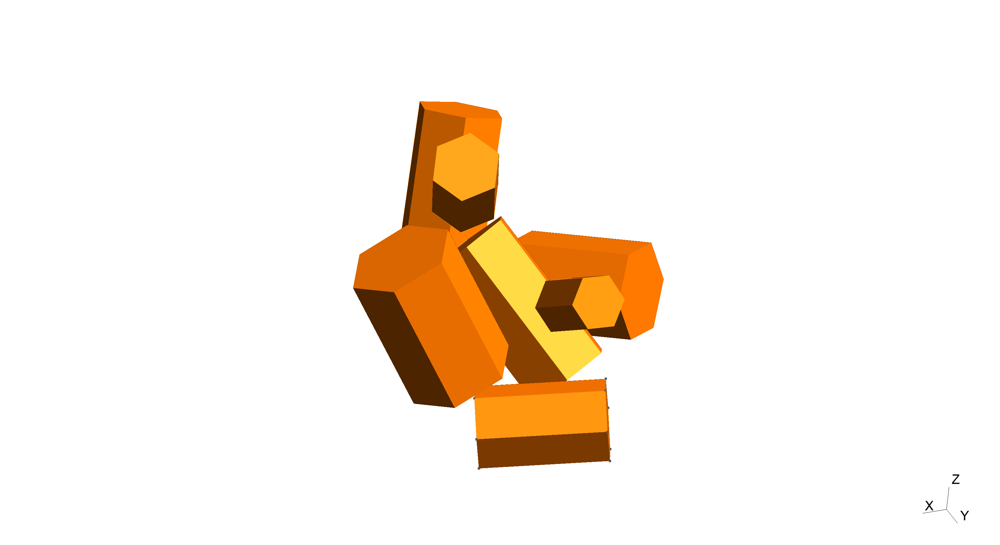

# Random orientation by an 8 branch aggregate

**8 branch aggregate as described in Yang *et al.*, but resized to 2mm. Some of the particles have been slightly moved to avoid intersecting monomers:** Yang, Ping, and K. N. Liou. "Single-scattering properties of complex ice crystals in terrestrial atmosphere." *Beitrage zur Physik der Atmosphare-Contributions to Atmospheric Physics* 71.2 (1998): 223-248.

login.py file from: https://github.com/pescap/cald

lebedev quadrature points from: https://bitbucket.org/CasperBeentjes/quadratures-on-unit-sphere/src/master/

Simulations run using bempp version 3.3.2 (https://bempp.com/)

**For details regarding the PMCHWT formulation and preconditioning used see:**

Kleanthous, Antigoni, et al. "Calderón preconditioning of PMCHWT boundary integral equations for scattering by multiple absorbing dielectric particles." *Journal of Quantitative Spectroscopy and Radiative Transfer* 224 (2019): 383-395.

Escapil-Inchauspé, Paul, and Carlos Jerez-Hanckes. "Fast calderón preconditioning for the electric field integral equation." *IEEE Transactions on Antennas and Propagation 67.4* (2019): 2555-2564.

Kleanthous, Antigoni, et al. "Accelerated Calderón preconditioning for Maxwell problems." *In Preparation*

